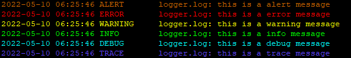

# ***logger***
Simple Object Orientated logger module for DCS World Mission Scripting Environment and Hook Environment.



## ***Introduction***
**logger** is a replacement for the commonly used `env.info`, `env.warning`, `env.error` logging functions for the Mission Scripting Environment. It is built around the `log.write` function that can be used in both the Mission Scripting Environment and Hook Environment. **logger** is also Object Oriented, which provides quick, clean, and easy to use methods that will allow you to debug your scripts better.

## **API Documentation**
The documentation for available methods can be found in the [wiki](https://github.com/Wizxrd/DCSLogger/wiki).

## **Installation**
### **Download**
download the latest **logger** version from the current [release]().

##  **DCS Setup**
### **Sanitize MissionScripting.lua**
This is only required if you intend on logging to a custom file, to do this you must make sure that you comment out the lines inside your MissionScripting.lua found in `C:/Program Files/Eagle Dynamics/DCS <Version>/Scripts/MissionScripting.lua` within the do block for `sanitizeModule('os')` and `sanitizeModule('io')`. It should look like this once done:
```lua
do
	--sanitizeModule('os')
	--sanitizeModule('io')
    sanitizeModule('lfs')
	_G['require'] = nil
	_G['loadlib'] = nil
	_G['package'] = nil
end
```
You should also comment out `sanitizeModule('lfs')` if you want to use `lfs.writedir()` to return your `C:/Users/userName/Saved Games/DCS.<version>/` folder.

### **Mission Scripting Environment** 
Bring logger.lua into the Mission Scripting Environment using a trigger:  
**TRIGGER: ONCE -> CONDITIONS: TIME MORE(1) -> ACTION: DO SCRIPT FILE(logger.lua)**  
### **Hook Environment**
Bring logger.lua into the Hook Environement within one of your scripts using the `dofile` function:
```lua
dofile("C:/PathToYourLogger/logger.lua")
```

## **FAQS**
**Q:** Why not just use `env` or `log` to write to dcs.log?  
**A:** Want to stop commenting out or removing bits of logging information? Look no further, logger provides an easy way of defining a log level so logging methods only execute at the defined level and below.

**Q:** Why would i want to log to another file besides dcs.log?  
**A:** In larger scripts and missions this can be quite useful as you can dedicate log files to specific scripts. This can aleve some headaches when searching through thousands of lines of debug information when all you're looking for is a stack traceback.

**Q:** Is writing to a custom log file slower than writing to dcs.log?  
**A:** Yes, this requires the use of `io` to write to the file causing some notible difference in performance. Writing to dcs.log on average took about `0.005` seconds while writing to a custom log file took on average about `0.030` seconds.